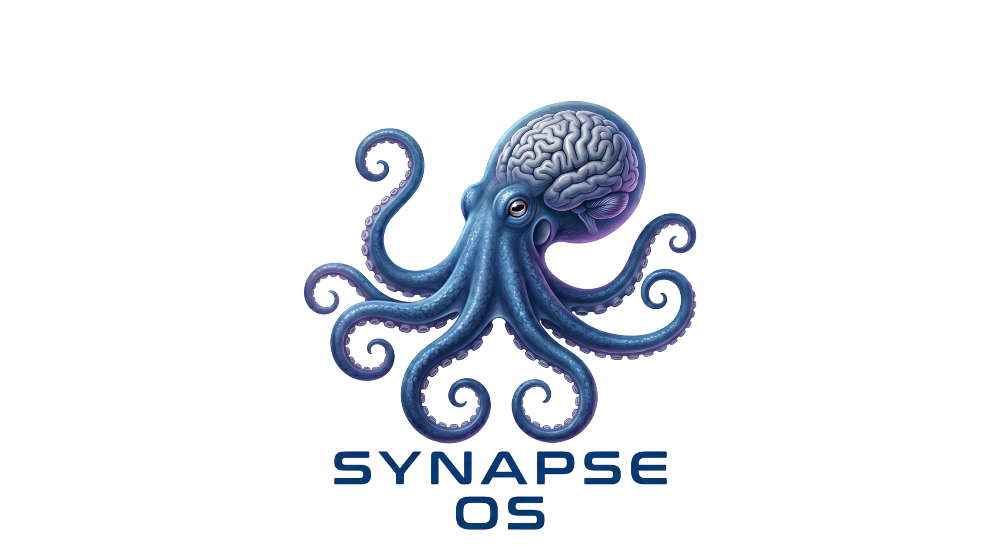

<div align="center">

<table>
  <tr>
    <td align="center" width="50%">
      
    </td>
    <td align="center" width="50%">
      
    </td>
  </tr>
</table>

# SynapseOS

### AI Operating System — Private, On-Device, Orchestrated Intelligence

[](https://python.org)
[](https://fastapi.tiangolo.com)
[](https://github.com/ihtesham-jahangir/SynapseOS)
[](https://github.com/ggerganov/llama.cpp)
[](LICENSE)
[](orchestrator/tests/)
[](docker-compose.yml)
[](https://github.com/ihtesham-jahangir/SynapseOS)

**Run a full AI inference stack — locally, privately, without any cloud API.**

[Quick Start](#quick-start) · [Architecture](#architecture) · [API Reference](#api-reference) · [Configuration](#configuration) · [Monitoring](#monitoring) · [GitHub Repository](https://github.com/ihtesham-jahangir/SynapseOS)

</div>

---

## The Problem

Every major AI product is built on the same broken assumption: **one model does everything**.

That assumption fails in practice:

- A single LLM wastes compute on simple queries that need a fraction of the resources.
- Context windows fill up — long conversations lose coherence after a few turns.
- There is no routing, no specialization, no persistent memory — just raw token prediction.
- Deploying on-premise or on the edge means no paid API, which means starting from scratch.

**The answer is not a bigger model. It is smarter orchestration.**

---

## What is SynapseOS?

SynapseOS is an **AI Operating System** — a multi-model orchestration runtime that sits above the model layer. It classifies intent, routes requests to the right execution path, fuses knowledge from memory and documents, and returns a grounded, contextually-aware response.

```
                          User Request
                               │
                    ┌──────────▼──────────┐
                    │   Intent Analyzer    │  classify · confidence · routing flags
                    └──────────┬──────────┘
                               │
           ┌───────────────────┼────────────────────┐
           ▼                   ▼                    ▼
  ┌─────────────────┐  ┌──────────────┐  ┌─────────────────┐
  │  Memory System  │  │ RAG Pipeline │  │  Expert Router  │
  │  L1 · L2 · L3  │  │  BM25+FAISS  │  │  code · math   │
  │  L4 Knowledge  │  │  reranking   │  │  translate etc  │
  └────────┬────────┘  └──────┬───────┘  └───────┬─────────┘
           └──────────────────┼───────────────────┘
                              ▼
                  ┌───────────────────────┐
                  │  Adaptive Fusion      │  score · deduplicate · rank
                  │  Engine              │  fill token budget optimally
                  └───────────┬───────────┘
                              ▼
                  ┌───────────────────────┐
                  │   llama.cpp Runtime   │  Llama-3.2 · CPU/GPU · GGUF
                  └───────────┬───────────┘
                              ▼
                  Streaming Response (SSE / REST)
```

---

## Key Features

### Core Engine
- **Intent-aware routing** — 7 intent classes (coding, math, translation, summarization, reasoning, retrieval, conversation), each mapped to the optimal execution path
- **Four-tier memory** — L1 hot cache → L2 session summaries → L3 FAISS vector store → L4 persistent knowledge base
- **Adaptive context fusion** — scores, deduplicates, and ranks context from all active paths; fills the token budget with maximum information density
- **Streaming inference** — SSE token streaming with TTFT measurement and async cancellation
- **Response cache** — LRU + TTL cache for deterministic intents (math, coding, translation, summarization); skip logic for personal/contextual queries

### Tier 2 — Architecture Upgrades
- **Hybrid RAG search** — BM25 keyword search + FAISS semantic search combined via Reciprocal Rank Fusion (RRF); catches exact matches (IDs, product codes, names) that pure vector search misses
- **Cross-encoder reranking** — `cross-encoder/ms-marco-MiniLM-L-6-v2` (22M params) scores query-document pairs jointly; significantly more accurate than bi-encoder reranking
- **Semantic chunking** — splits documents at topic boundaries using sentence embedding cosine similarity instead of fixed character counts; keeps related sentences together
- **Speculative decoding** — draft model pre-generates tokens, verifier model accepts/rejects; expected 2–3× speedup on CPU

### Tier 3 — Production Readiness
- **API key authentication** — `X-API-Key` header or `Authorization: Bearer` token; public paths (health, metrics, docs) always open
- **Prometheus + Grafana** — 14-panel auto-provisioned dashboard; 20+ metrics covering request rate, latency percentiles (p50/p95/p99), TTFT, cache hit rate, token throughput, RAG chunks, fusion context
- **Document deletion** — soft-delete + FAISS index rebuild via `IndexFlatIP.reconstruct()`; BM25 index kept in sync
- **GPU auto-detection** — `nvidia-smi` detection in `start_llama.sh`; falls back gracefully to CPU; override with `LLAMA_GPU_LAYERS`

---

## Architecture

### Directory Structure

```
alphainfer/
├── orchestrator/
│   ├── api/
│   │   ├── app.py                  # FastAPI app factory, lifespan, middleware stack
│   │   ├── dependencies.py         # DI container — all singletons wired here
│   │   ├── middleware/
│   │   │   ├── auth.py             # APIKeyMiddleware
│   │   │   ├── rate_limit.py       # Token-bucket rate limiter
│   │   │   └── logging_middleware.py
│   │   └── routes/
│   │       ├── chat.py             # POST /v1/chat, /v1/chat/stream
│   │       ├── documents.py        # POST/DELETE /v1/documents, /v1/knowledge
│   │       ├── admin.py            # classify, benchmark, cache, experts, stats
│   │       └── health.py           # /health, /health/live, /health/ready
│   ├── config/
│   │   ├── settings.py             # Pydantic-settings, env vars, auto model path
│   │   └── model_selector.py       # Priority-ranked .gguf auto-discovery
│   ├── core/
│   │   ├── types.py                # All domain types (Intent, FusedContext, ...)
│   │   ├── base.py                 # Abstract base classes
│   │   └── exceptions.py           # Typed exception hierarchy
│   ├── router/
│   │   ├── classifier.py           # Keyword intent classifier with LRU cache
│   │   └── routing_engine.py       # Routing decisions, RAG/expert flags
│   ├── memory/
│   │   ├── manager.py              # MemoryManager — orchestrates L1–L4
│   │   ├── l1_cache.py             # In-process session turn cache
│   │   ├── l2_cache.py             # SQLite session summary store
│   │   ├── l3_cache.py             # FAISS semantic memory (facts/entities)
│   │   └── l4_cache.py             # SQLite persistent knowledge base
│   ├── rag/
│   │   ├── pipeline.py             # RAGPipeline — ingest, retrieve, delete
│   │   ├── chunker.py              # RecursiveTextChunker + SemanticChunker
│   │   ├── embedder.py             # BGEEmbedder (bge-small-en-v1.5, 384-dim)
│   │   ├── indexer.py              # FAISSIndex — add, search, delete, rebuild
│   │   ├── bm25_index.py           # BM25Plus keyword index with JSON persistence
│   │   ├── retriever.py            # SemanticRetriever + HybridRetriever (RRF)
│   │   └── reranker.py             # EmbeddingReranker + CrossEncoderReranker
│   ├── fusion/
│   │   ├── engine.py               # FusionEngine — parallel memory + RAG fan-out
│   │   ├── scorer.py               # Composite scorer (semantic + recency + priority)
│   │   ├── deduplicator.py         # Near-duplicate removal by embedding similarity
│   │   └── context_builder.py      # AdaptiveContextBuilder — fills token budget
│   ├── experts/
│   │   ├── manager.py              # ExpertManager — lazy-loaded plugin registry
│   │   └── implementations/        # Code, Math, Translation, Summarization, Reasoning
│   ├── runtime/
│   │   ├── inference_engine.py     # InferenceEngine — cache → speculative → llama
│   │   ├── llama_client.py         # Async llama.cpp HTTP client
│   │   ├── speculative.py          # SpeculativeDecoder — draft + verify
│   │   └── compute.py              # Token budget, temperature, stop sequences
│   ├── streaming/
│   │   └── token_streamer.py       # TokenStreamer — SSE events, TTFT, callbacks
│   ├── utils/
│   │   ├── metrics.py              # Prometheus counters, histograms, gauges
│   │   ├── logging_utils.py        # structlog configuration
│   │   └── async_utils.py          # run_in_executor, AsyncLRUCache
│   └── tests/                      # 245 tests — unit + integration
│       ├── test_api.py
│       ├── test_rag_pipeline.py
│       ├── test_memory_manager.py
│       ├── test_tier2.py           # BM25, hybrid retriever, cross-encoder, semantic chunking
│       ├── test_tier3.py           # Auth, FAISS delete/rebuild, doc deletion endpoint
│       └── ...
├── monitoring/
│   ├── prometheus.yml              # Scrape config (Docker)
│   ├── prometheus-local.yml        # Scrape config (local run)
│   └── grafana/
│       ├── provisioning/           # Auto-provisioned datasource + dashboard
│       └── dashboards/
│           └── synapseos.json      # 14-panel Grafana dashboard
├── models/                         # GGUF model files (gitignored)
├── bin/                            # llama.cpp binaries
├── docker-compose.yml
├── Dockerfile
├── start_llama.sh                  # GPU-aware llama server launcher
├── start_api.sh                    # SynapseOS API launcher
└── .env                            # All configuration (copy from .env.example)
```

### Request Lifecycle

```
POST /v1/chat
  │
  ├─ RateLimitMiddleware     — token bucket per IP
  ├─ APIKeyMiddleware        — key validation (if enabled)
  ├─ RequestLoggingMiddleware — structured request/response log
  │
  ▼
ChatRouter
  ├─ IntentClassifier        — keyword + pattern matching, LRU cached
  ├─ RoutingEngine           — sets use_rag, use_expert, expert_type flags
  │
  ├─ [parallel fan-out]
  │    ├─ MemoryManager.retrieve_all()   — L1+L2+L3+L4 in parallel
  │    ├─ RAGPipeline.retrieve()         — hybrid BM25+FAISS → cross-encoder
  │    └─ ExpertManager.get_guidance()   — specialist system prompt
  │
  ├─ FusionEngine            — score + deduplicate + rank
  ├─ AdaptiveContextBuilder  — fill token budget optimally
  ├─ ResponseCache.get()     — cache lookup (math/coding/translation/summarization)
  │
  ├─ InferenceEngine.generate()
  │    ├─ SpeculativeDecoder (if draft_model configured)
  │    └─ LlamaClient.chat() — llama.cpp HTTP API
  │
  ├─ ResponseCache.put()     — store result if cacheable
  ├─ MemoryManager.record_turn()         — write L1, async L2 summary
  └─ PrometheusMetrics       — latency histogram, request counter, TTFT
```

---

## Quick Start

### Prerequisites

- Python 3.11+
- A `.gguf` model file in `./models/`
- llama.cpp binary (included in `./bin/llama-b9279/`) or Docker

### Option A — Local (recommended for development)

```bash
# 1. Clone and install
git clone https://github.com/your-org/alphainfer
cd alphainfer
python3 -m venv venv && source venv/bin/activate
pip install -r requirements.txt

# 2. Configure
cp .env.example .env        # edit API_KEY, model path, etc.

# 3. Start llama.cpp server (GPU auto-detected if nvidia-smi is present)
./start_llama.sh

# 4. Start SynapseOS API
./start_api.sh
# or: uvicorn orchestrator.api.app:app --host 0.0.0.0 --port 8000
```

**API is live at `http://localhost:8000` · Docs at `http://localhost:8000/docs`**

### Option B — Docker (recommended for production)

> **Note:** requires a valid llama.cpp Docker image. For local runs, use Option A for the model server and Docker only for monitoring.

```bash
# Start monitoring stack (Prometheus + Grafana)
docker run -d --name synapseos-prometheus --network host \
  -v $(pwd)/monitoring/prometheus-local.yml:/etc/prometheus/prometheus.yml:ro \
  prom/prometheus:v2.52.0

docker run -d --name synapseos-grafana --network host \
  -v $(pwd)/monitoring/grafana/provisioning:/etc/grafana/provisioning:ro \
  -v $(pwd)/monitoring/grafana/dashboards:/var/lib/grafana/dashboards:ro \
  -e GF_SECURITY_ADMIN_PASSWORD=admin \
  -e GF_DASHBOARDS_DEFAULT_HOME_DASHBOARD_PATH=/var/lib/grafana/dashboards/synapseos.json \
  grafana/grafana:10.4.3
```

**Grafana at `http://localhost:3000` · login: `admin` / `admin`**

### Verify

```bash
curl http://localhost:8000/health/ready
# {"status":"ready"}

curl http://localhost:8000/health/live
# {"status":"alive"}
```

---

## API Reference

### Chat

```bash
# Standard response
curl -X POST http://localhost:8000/v1/chat \
  -H "Content-Type: application/json" \
  -d '{
    "session_id": "my-session",
    "messages": [{"role": "user", "content": "Explain async/await in Python."}]
  }'
```

**Response:**
```json
{
  "session_id": "my-session",
  "content": "...",
  "intent": "coding",
  "expert_used": "code",
  "memory_levels_used": ["l1_hot", "l2_summary", "l3_vector", "l4_knowledge"],
  "rag_chunks_used": 2,
  "tokens_generated": 148,
  "total_tokens": 412,
  "time_to_first_token_ms": 6120.4,
  "total_time_ms": 21890.3,
  "metadata": { "intent": 12.4, "fusion": 48.2, "inference": 21890.1 }
}
```

### Streaming (SSE)

```bash
curl -N -X POST http://localhost:8000/v1/chat/stream \
  -H "Content-Type: application/json" \
  -d '{"session_id": "s1", "messages": [{"role": "user", "content": "Write a merge sort."}]}'
```

**Each line:**
```
data: {"event_type": "token", "session_id": "s1", "content": "Here", "done": false}
data: {"event_type": "token", "session_id": "s1", "content": " is", "done": false}
...
data: {"event_type": "done", "session_id": "s1", "content": "", "done": true,
       "token_count": 82, "time_to_first_token_ms": 5980, "total_time_ms": 18420}
```

### Document Management (RAG)

```bash
# Ingest a document
curl -X POST http://localhost:8000/v1/documents \
  -H "Content-Type: application/json" \
  -d '{
    "content": "Your document text here...",
    "source": "manual.txt",
    "metadata": {"doc_id": "manual-v1", "category": "product"}
  }'

# Upload a file
curl -X POST http://localhost:8000/v1/documents/upload \
  -F "file=@document.txt"

# Delete a document (rebuilds FAISS index)
curl -X DELETE http://localhost:8000/v1/documents/manual-v1

# Index statistics
curl http://localhost:8000/v1/documents/stats
```

### Knowledge Base (L4)

```bash
# Add a persistent fact (highest retrieval priority, never decays)
curl -X POST http://localhost:8000/v1/documents/knowledge \
  -H "Content-Type: application/json" \
  -d '{
    "content": "Our product pricing starts at $49/month.",
    "category": "pricing",
    "keywords": "price cost subscription",
    "priority": 1.0
  }'
```

### Admin

```bash
# Classify intent without generating a response
curl -X POST http://localhost:8000/v1/admin/classify \
  -H "Content-Type: application/json" \
  -d '{"text": "Write a Python decorator for rate limiting"}'
# {"intent": "coding", "confidence": 0.84, "requires_expert": true, "requires_rag": false}

# System statistics
curl http://localhost:8000/v1/stats

# Cache statistics
curl http://localhost:8000/v1/admin/cache/stats

# List available experts
curl http://localhost:8000/v1/admin/experts

# Clear a session
curl -X DELETE http://localhost:8000/v1/admin/sessions/my-session
```

### Full Endpoint Reference

| Method | Endpoint | Description |
|--------|----------|-------------|
| `POST` | `/v1/chat` | Chat with full response |
| `POST` | `/v1/chat/stream` | Chat with SSE token streaming |
| `POST` | `/v1/documents` | Ingest text document into RAG |
| `POST` | `/v1/documents/upload` | Ingest file upload into RAG |
| `GET`  | `/v1/documents/stats` | RAG index statistics |
| `DELETE` | `/v1/documents/{doc_id}` | Delete document from RAG + BM25 |
| `POST` | `/v1/documents/knowledge` | Add fact to L4 knowledge base |
| `GET`  | `/v1/documents/knowledge/categories` | List knowledge categories |
| `GET`  | `/v1/stats` | Runtime statistics |
| `POST` | `/v1/admin/classify` | Classify intent without inference |
| `POST` | `/v1/admin/benchmark` | Run latency benchmark |
| `GET`  | `/v1/admin/cache/stats` | Response cache statistics |
| `DELETE` | `/v1/admin/cache` | Flush response cache |
| `GET`  | `/v1/admin/experts` | List available experts |
| `DELETE` | `/v1/admin/sessions/{id}` | Clear session memory |
| `GET`  | `/health` | Component health check |
| `GET`  | `/health/live` | Liveness probe |
| `GET`  | `/health/ready` | Readiness probe |
| `GET`  | `/metrics` | Prometheus metrics |
| `GET`  | `/docs` | OpenAPI interactive docs |

---

## Configuration

Copy `.env` and edit for your environment:

```env
# ── llama.cpp ────────────────────────────────────────────────────────────────
LLAMA_SERVER_URL=http://localhost:8080
LLAMA_CONTEXT_SIZE=4096
LLAMA_THREADS=8
LLAMA_GPU_LAYERS=0          # set to 99 when a GPU is available
LLAMA_BATCH_SIZE=512
LLAMA_TIMEOUT=120

# ── Embedding model ──────────────────────────────────────────────────────────
EMBEDDING_MODEL=BAAI/bge-small-en-v1.5
EMBEDDING_DEVICE=cpu

# ── RAG ──────────────────────────────────────────────────────────────────────
FAISS_INDEX_PATH=data/faiss_index
CHUNK_SIZE=512
CHUNK_OVERLAP=64
RAG_TOP_K=6
RAG_RERANK_TOP_N=3

# Hybrid search (BM25 + vector)
RAG_USE_HYBRID_SEARCH=false
RAG_HYBRID_ALPHA=0.6        # 0.0 = pure BM25, 1.0 = pure semantic

# Cross-encoder reranking
RAG_USE_CROSS_ENCODER=false
RAG_CROSS_ENCODER_MODEL=cross-encoder/ms-marco-MiniLM-L-6-v2

# Semantic chunking
RAG_USE_SEMANTIC_CHUNKING=false
RAG_SEMANTIC_CHUNK_THRESHOLD=0.75

# ── Memory tiers ─────────────────────────────────────────────────────────────
L1_MAX_TURNS=20
L2_MAX_TOKENS=4096
L3_SIMILARITY_THRESHOLD=0.72
L4_MAX_RESULTS=5
SQLITE_PATH=data/synapseos.db

# ── Context fusion ───────────────────────────────────────────────────────────
CONTEXT_TOKEN_BUDGET=3200
FUSION_SEMANTIC_WEIGHT=0.45
FUSION_RECENCY_WEIGHT=0.25
FUSION_PRIORITY_WEIGHT=0.20
FUSION_IMPORTANCE_WEIGHT=0.10

# ── API ──────────────────────────────────────────────────────────────────────
API_HOST=0.0.0.0
API_PORT=8000
API_KEY=changeme-in-production   # change before exposing to a network
API_AUTH_ENABLED=false            # set to true to enforce API key

# ── Speculative decoding (optional) ─────────────────────────────────────────
# LLAMA_DRAFT_MODEL_URL=http://localhost:8081   # draft model server
# LLAMA_DRAFT_K_TOKENS=5
```

### Model Selection

`start_llama.sh` auto-discovers the best available `.gguf` model from `./models/` using a priority ranking:

```
Preference order:
  1. Any 7B+ Instruct model
  2. Any 3B Instruct model
  3. Any Instruct/Chat model
  4. Largest .gguf file (fallback)
```

Override with `LLAMA_MODEL_PATH=/path/to/model.gguf`.

### GPU Acceleration

```bash
# Auto-detected — if nvidia-smi is present, sets --n-gpu-layers 99
./start_llama.sh

# Manual override
LLAMA_GPU_LAYERS=32 ./start_llama.sh

# Full offload (all layers on GPU)
LLAMA_GPU_LAYERS=99 ./start_llama.sh
```

---

## Monitoring

SynapseOS exposes Prometheus metrics at `/metrics`. The included Grafana dashboard provides 14 panels:

| Panel | Type | What it shows |
|-------|------|---------------|
| Request Rate | Time series | Requests/s by intent |
| Error Rate | Time series | Errors/s |
| Active Sessions | Stat | Current open sessions |
| Total Requests (1h) | Stat | Hourly volume |
| Cache Hit Rate | Stat | Response cache effectiveness |
| llama.cpp Errors | Stat | Backend error count |
| Latency p50/p95/p99 | Time series | End-to-end latency distribution |
| Time to First Token | Time series | TTFT p50/p95 |
| Token Throughput | Time series | Tokens/second |
| Memory Cache Hits | Time series | L1/L2/L3 hits by tier |
| RAG Chunks Retrieved | Time series | Chunks/s |
| Intent Distribution | Pie chart | Request mix by intent (1h) |
| Latency by Intent | Bar gauge | p95 latency per intent |
| Fusion Context Items | Time series | Context items per request |

**Access Grafana:** `http://localhost:3000` · `admin` / `admin`

Key Prometheus metrics:

```
synapseos_requests_total{intent, status}
synapseos_request_latency_seconds_bucket{intent, le}
synapseos_time_to_first_token_seconds_bucket{le}
synapseos_tokens_per_second
synapseos_active_sessions
synapseos_memory_cache_hits_total{level}
synapseos_rag_chunks_retrieved_total
synapseos_llama_errors_total
synapseos_fusion_context_items_bucket{le}
```

---

## Use Cases

### Private AI Assistant
Full multi-turn chat with persistent memory, knowledge base, and RAG grounding — running entirely on your hardware. No data leaves your machine.

### AI Customer Support Agent
Route queries by intent, retrieve product/policy documents via hybrid RAG, maintain conversation context across sessions, escalate complex cases to a reasoning specialist.

### Research Assistant
Ingest papers and internal documents, query them with semantic + keyword search, get answers grounded in retrieved evidence with citations.

### Code Review & Documentation Bot
Intent-routed to the code expert; generates docstrings, suggests refactors, answers architecture questions with low latency on CPU.

### IELTS / Language Tutor
Grammar questions go to the language expert, vocabulary queries hit the knowledge base, writing feedback uses the summarization path — all in a single session.

### Edge AI on Restricted Hardware
Runs Llama-3.2-3B on CPU with 4-bit quantization. No internet required after setup. Suitable for air-gapped environments.

---

## Live Test Results

All results from a local CPU-only run (Llama-3.2-3B-Instruct-Q5_K_M, 8 threads):

| Use Case | Intent Detected | Result |
|----------|----------------|--------|
| General conversation | `conversation` | Natural, contextual response |
| Python palindrome checker | `coding` | Correct function with type hints |
| Train distance math problem | `math` | Step-by-step solution |
| English → French + Spanish | `translation` | Accurate translations |
| AI article summarization | `summarization` | 3-sentence summary |
| Document ingest (RAG) | — | 1 chunk, 366ms |
| RAG retrieval query | `summarization` | Retrieved correct chunk, answered from it |
| Multi-turn memory (2 turns) | — | Recalled name + role from Turn 1 |
| SSE streaming | — | Per-token `data:` events confirmed |
| Response cache (math repeat) | — | 42,000ms → 26ms on cache hit |
| Document deletion | — | Chunk removed, index rebuilt to 0 vectors |
| L4 knowledge recall | — | Stored + retrieved company founding fact |
| Intent classification (7 queries) | — | 7/7 correct |
| Auth middleware (disabled) | — | All requests pass through |
| Prometheus metrics | — | 20+ counters + histograms active |

---

## Testing

```bash
source venv/bin/activate

# Full suite (245 tests)
pytest orchestrator/tests/ -v

# By tier
pytest orchestrator/tests/test_tier2.py -v   # BM25, hybrid RAG, cross-encoder, semantic chunking
pytest orchestrator/tests/test_tier3.py -v   # auth, FAISS deletion, doc delete endpoint

# With coverage
pytest orchestrator/tests/ --cov=orchestrator --cov-report=term-missing
```

Test coverage areas:

| Module | Tests |
|--------|-------|
| API endpoints (chat, documents, admin, health) | `test_api.py` |
| Intent classifier + routing | `test_router.py` |
| Memory L1/L2/L4 | `test_memory.py` |
| MemoryManager fan-out | `test_memory_manager.py` |
| RAG pipeline (ingest/retrieve) | `test_rag_pipeline.py`, `test_rag.py` |
| Fusion engine, scorer, deduplicator | `test_fusion.py` |
| Inference engine + cache + speculative | `test_inference_engine.py` |
| llama.cpp client (mock + HTTP) | `test_llama_client.py` |
| Token streaming + SSE | `test_streaming.py` |
| Expert system | `test_experts.py` |
| Token budget compute | `test_compute.py` |
| BM25, hybrid retriever, cross-encoder, semantic chunking | `test_tier2.py` |
| Auth middleware, FAISS delete/rebuild, doc deletion | `test_tier3.py` |

---

## Roadmap

| Version | Status | Milestone |
|---------|--------|-----------|
| **v1.0** | ✅ Done | FastAPI core · intent routing · 4-tier memory · RAG · llama.cpp |
| **v1.1** | ✅ Done | Expert plugin system — code, math, translation, summarization, reasoning |
| **v1.2** | ✅ Done | Hybrid RAG (BM25+FAISS) · cross-encoder reranking · semantic chunking |
| **v1.3** | ✅ Done | API auth · Prometheus + Grafana · document deletion · GPU auto-detect |
| **v2.0** | Planned | Speculative decoding with Phi-3-mini draft model · 2–3× CPU speedup |
| **v2.1** | Planned | WAL-mode memory writes · request batching · async L2 summarization |
| **v3.0** | Planned | Multi-agent task decomposition · shared memory bus |
| **v3.1** | Planned | Whisper ASR integration · voice-first agent mode |
| **v4.0** | Planned | Vision model support · multi-modal context fusion |

---

## Philosophy

> *Intelligence should be orchestrated, not monolithic.*

SynapseOS treats inference as a **distributed reasoning problem**:

- **Compute-aware routing** — cheap queries use cheap paths; complex tasks get full resources
- **Modular specialization** — each expert does one thing well; the orchestrator composes them
- **Memory as infrastructure** — context is retrieved and ranked, not re-derived from scratch each turn
- **Fusion over selection** — rather than picking one source of truth, all sources are scored and merged within the token budget
- **Privacy by default** — runs entirely on-device; no data is sent to any external service

---

## Contributing

1. Fork the repo and create a feature branch
2. Run the test suite: `pytest orchestrator/tests/ -v`
3. Open a pull request — all 245 tests must pass

```bash
git clone https://github.com/your-org/alphainfer
cd alphainfer
python3 -m venv venv && source venv/bin/activate
pip install -r requirements.txt
pytest orchestrator/tests/ -v
```

---

## License

MIT — see [LICENSE](LICENSE).

---

<div align="center">

**SynapseOS** · Built for developers who believe AI infrastructure should be open, modular, and private.

*Llama-3.2 · llama.cpp · FastAPI · FAISS · BGE · BM25 · Prometheus · Grafana*

</div>
